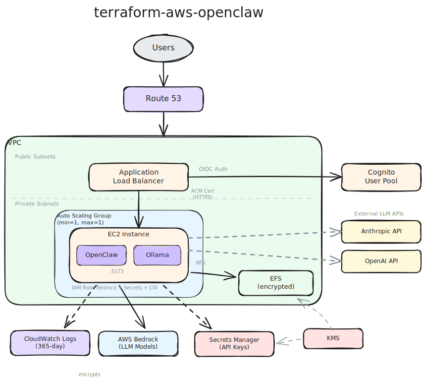

# terraform-aws-openclaw

[](https://infrahouse.com/contact)
[](https://infrahouse.github.io/terraform-aws-openclaw/)
[](https://registry.infrahouse.com/modules/infrahouse/openclaw/aws)
[](https://github.com/infrahouse/terraform-aws-openclaw/releases/latest)
[](https://github.com/infrahouse/terraform-aws-openclaw/actions/workflows/vuln-scanner-pr.yml)
[](LICENSE)

[](https://aws.amazon.com/ec2/)
[](https://aws.amazon.com/bedrock/)
[](https://aws.amazon.com/cognito/)

Deploys [OpenClaw](https://github.com/openclaw) AI agent gateway on AWS
using EC2 behind an ALB with Cognito authentication and multi-provider
LLM support (Bedrock, Anthropic API, OpenAI API, Ollama).



## Features

- ALB with ACM certificate and Cognito-based authentication
- Multiple LLM provider support: AWS Bedrock, Anthropic API, OpenAI API, Ollama (local)
- API keys stored in Secrets Manager (KMS-encrypted via `infrahouse/secret/aws`)
- EFS persistence for config and agent data across instance replacements
- Deep-merge config strategy: Terraform manages infrastructure, UI changes persist
- Ollama installed for local model inference
- CloudWatch logging with 365-day retention (ISO27001/SOC2)
- Cognito user pool with optional MFA and advanced security
- Systemd hardening (ProtectSystem, ProtectHome, NoNewPrivileges)

## Quick Start

```hcl
module "openclaw" {
  source  = "registry.infrahouse.com/infrahouse/openclaw/aws"
  version = "0.3.3"
  providers = {
    aws     = aws
    aws.dns = aws
  }

  environment        = "production"
  zone_id            = aws_route53_zone.example.zone_id
  alb_subnet_ids     = module.network.subnet_public_ids
  backend_subnet_ids = module.network.subnet_private_ids
  alarm_emails       = ["ops@example.com"]

  cognito_users = [
    {
      email     = "admin@example.com"
      full_name = "Admin User"
    },
  ]
}
```

The module works out of the box — AWS Bedrock (Amazon Nova 2 Lite) is the
default LLM provider and requires no API keys. See the
[Getting Started](https://infrahouse.github.io/terraform-aws-openclaw/getting-started/)
guide for first login and optional provider setup.

## Documentation

- [Getting Started](https://infrahouse.github.io/terraform-aws-openclaw/getting-started/)
- [Configuration](https://infrahouse.github.io/terraform-aws-openclaw/configuration/)
- [Architecture](https://infrahouse.github.io/terraform-aws-openclaw/architecture/)
- [Security](https://infrahouse.github.io/terraform-aws-openclaw/security-considerations/)
- [FAQ / Troubleshooting](https://infrahouse.github.io/terraform-aws-openclaw/FAQ/)

## LLM Provider Options

| Provider | Configuration | Default? |
|----------|--------------|----------|
| **Bedrock** | Uses IAM, no API keys. Nova 2 Lite is the default model. | Yes |
| **Anthropic API** | Optional. Add `ANTHROPIC_API_KEY` to the Secrets Manager secret. | No |
| **OpenAI API** | Optional. Add `OPENAI_API_KEY` to the Secrets Manager secret. | No |
| **Ollama** | Local models. Set `ollama_default_model` to pre-pull a model. | Available |

## Security

This module replaces OpenClaw's default setup patterns with
production-grade security controls. Key differences from the default
install guide:

- **Cognito + ALB authentication** replaces the shared gateway token —
  no secrets in the browser, per-user identity, optional MFA
- **Supply chain hardening** — Node.js via GPG-verified APT repo, Ollama
  from binary tarball, OpenClaw via unprivileged local npm install (no
  `curl | sh` as root)
- **Systemd hardening** — `ProtectSystem=strict`, `ProtectHome=tmpfs`,
  `NoNewPrivileges=true` on both OpenClaw and Ollama services
- **Secrets in Secrets Manager** — API keys encrypted with KMS, never in
  plaintext userdata or config files
- **Network isolation** — backend EC2 only reachable through the ALB
  security group, EFS restricted to NFS from backend subnets, Ollama
  bound to localhost

See [Security Considerations](https://infrahouse.github.io/terraform-aws-openclaw/security-considerations/)
for the full threat model and design rationale.

## Instance Sizing for Ollama Models

The `instance_type` should match the Ollama model you plan to run. Ollama
models are loaded entirely into RAM; if the model exceeds available memory the
instance will swap heavily and become unresponsive.

| Ollama model | Params | RAM needed | Recommended instance | Monthly cost |
|-------------|--------|-----------|---------------------|-------------|
| qwen2.5:1.5b, phi3:mini, gemma2:2b | 1-3B | 2-4 GB | t3.large (8 GB) | ~$60 |
| llama3.1:8b, mistral:7b, qwen2.5:7b | 7-8B | 5-8 GB | t3.xlarge (16 GB) | ~$121 |
| qwen2.5:14b, llama2:13b | 13-14B | 10-16 GB | r6i.xlarge (32 GB) | ~$181 |
| codellama:34b, deepseek-coder:33b | 30-34B | 20-36 GB | r6i.2xlarge (64 GB) | ~$363 |
| llama3.1:70b | 70B | 40-48 GB | r6i.4xlarge (128 GB) | ~$725 |

The default `t3.large` (8 GB) is sufficient when using only cloud LLM providers
(Bedrock, Anthropic API, OpenAI API) with a small local model for
experimentation. If you don't need local models, set `ollama_default_model = null`
to skip the model pull entirely.

## Examples

See the [examples/](examples/) directory for working configurations.

## Contributing

See [CONTRIBUTING.md](CONTRIBUTING.md) for guidelines.

## License

[Apache 2.0](LICENSE)

<!-- BEGIN_TF_DOCS -->

## Requirements

| Name | Version |
|------|---------|
| <a name="requirement_terraform"></a> [terraform](#requirement\_terraform) | >= 1.5 |
| <a name="requirement_aws"></a> [aws](#requirement\_aws) | ~> 6.0 |
| <a name="requirement_random"></a> [random](#requirement\_random) | ~> 3.0 |
| <a name="requirement_tls"></a> [tls](#requirement\_tls) | ~> 4.0 |

## Providers

| Name | Version |
|------|---------|
| <a name="provider_aws"></a> [aws](#provider\_aws) | ~> 6.0 |
| <a name="provider_random"></a> [random](#provider\_random) | ~> 3.0 |
| <a name="provider_tls"></a> [tls](#provider\_tls) | ~> 4.0 |

## Modules

| Name | Source | Version |
|------|--------|---------|
| <a name="module_api_keys"></a> [api\_keys](#module\_api\_keys) | registry.infrahouse.com/infrahouse/secret/aws | 1.1.1 |
| <a name="module_openclaw_pod"></a> [openclaw\_pod](#module\_openclaw\_pod) | registry.infrahouse.com/infrahouse/website-pod/aws | 5.17.0 |
| <a name="module_openclaw_userdata"></a> [openclaw\_userdata](#module\_openclaw\_userdata) | registry.infrahouse.com/infrahouse/cloud-init/aws | 2.3.0 |

## Resources

| Name | Type |
|------|------|
| [aws_cloudwatch_log_group.this](https://registry.terraform.io/providers/hashicorp/aws/latest/docs/resources/cloudwatch_log_group) | resource |
| [aws_cognito_user.users](https://registry.terraform.io/providers/hashicorp/aws/latest/docs/resources/cognito_user) | resource |
| [aws_cognito_user_pool.this](https://registry.terraform.io/providers/hashicorp/aws/latest/docs/resources/cognito_user_pool) | resource |
| [aws_cognito_user_pool_client.this](https://registry.terraform.io/providers/hashicorp/aws/latest/docs/resources/cognito_user_pool_client) | resource |
| [aws_cognito_user_pool_domain.this](https://registry.terraform.io/providers/hashicorp/aws/latest/docs/resources/cognito_user_pool_domain) | resource |
| [aws_efs_backup_policy.this](https://registry.terraform.io/providers/hashicorp/aws/latest/docs/resources/efs_backup_policy) | resource |
| [aws_efs_file_system.this](https://registry.terraform.io/providers/hashicorp/aws/latest/docs/resources/efs_file_system) | resource |
| [aws_efs_mount_target.this](https://registry.terraform.io/providers/hashicorp/aws/latest/docs/resources/efs_mount_target) | resource |
| [aws_key_pair.this](https://registry.terraform.io/providers/hashicorp/aws/latest/docs/resources/key_pair) | resource |
| [aws_kms_alias.cloudwatch](https://registry.terraform.io/providers/hashicorp/aws/latest/docs/resources/kms_alias) | resource |
| [aws_kms_key.cloudwatch](https://registry.terraform.io/providers/hashicorp/aws/latest/docs/resources/kms_key) | resource |
| [aws_lb_listener_rule.cognito_auth](https://registry.terraform.io/providers/hashicorp/aws/latest/docs/resources/lb_listener_rule) | resource |
| [aws_security_group.efs](https://registry.terraform.io/providers/hashicorp/aws/latest/docs/resources/security_group) | resource |
| [aws_vpc_security_group_egress_rule.efs](https://registry.terraform.io/providers/hashicorp/aws/latest/docs/resources/vpc_security_group_egress_rule) | resource |
| [aws_vpc_security_group_ingress_rule.efs_nfs](https://registry.terraform.io/providers/hashicorp/aws/latest/docs/resources/vpc_security_group_ingress_rule) | resource |
| [random_password.gateway_auth](https://registry.terraform.io/providers/hashicorp/random/latest/docs/resources/password) | resource |
| [random_password.users](https://registry.terraform.io/providers/hashicorp/random/latest/docs/resources/password) | resource |
| [random_string.cloudwatch_kms](https://registry.terraform.io/providers/hashicorp/random/latest/docs/resources/string) | resource |
| [tls_private_key.this](https://registry.terraform.io/providers/hashicorp/tls/latest/docs/resources/private_key) | resource |
| [aws_ami.infrahouse_pro_noble](https://registry.terraform.io/providers/hashicorp/aws/latest/docs/data-sources/ami) | data source |
| [aws_caller_identity.this](https://registry.terraform.io/providers/hashicorp/aws/latest/docs/data-sources/caller_identity) | data source |
| [aws_iam_policy_document.cloudwatch_kms](https://registry.terraform.io/providers/hashicorp/aws/latest/docs/data-sources/iam_policy_document) | data source |
| [aws_iam_policy_document.cloudwatch_logs](https://registry.terraform.io/providers/hashicorp/aws/latest/docs/data-sources/iam_policy_document) | data source |
| [aws_iam_policy_document.combined_permissions](https://registry.terraform.io/providers/hashicorp/aws/latest/docs/data-sources/iam_policy_document) | data source |
| [aws_iam_policy_document.instance_permissions](https://registry.terraform.io/providers/hashicorp/aws/latest/docs/data-sources/iam_policy_document) | data source |
| [aws_iam_role.instance](https://registry.terraform.io/providers/hashicorp/aws/latest/docs/data-sources/iam_role) | data source |
| [aws_kms_key.efs_default](https://registry.terraform.io/providers/hashicorp/aws/latest/docs/data-sources/kms_key) | data source |
| [aws_region.this](https://registry.terraform.io/providers/hashicorp/aws/latest/docs/data-sources/region) | data source |
| [aws_route53_zone.this](https://registry.terraform.io/providers/hashicorp/aws/latest/docs/data-sources/route53_zone) | data source |
| [aws_subnet.alb](https://registry.terraform.io/providers/hashicorp/aws/latest/docs/data-sources/subnet) | data source |
| [aws_subnet.backend](https://registry.terraform.io/providers/hashicorp/aws/latest/docs/data-sources/subnet) | data source |

## Inputs

| Name | Description | Type | Default | Required |
|------|-------------|------|---------|:--------:|
| <a name="input_alarm_emails"></a> [alarm\_emails](#input\_alarm\_emails) | Email addresses for CloudWatch alarm notifications (ALB health, latency, 5xx). | `list(string)` | n/a | yes |
| <a name="input_alb_access_log_force_destroy"></a> [alb\_access\_log\_force\_destroy](#input\_alb\_access\_log\_force\_destroy) | Destroy ALB access log S3 bucket even if non-empty. Enable for testing. | `bool` | `false` | no |
| <a name="input_alb_subnet_ids"></a> [alb\_subnet\_ids](#input\_alb\_subnet\_ids) | Subnet IDs for the ALB (public subnets in at least two AZs). | `list(string)` | n/a | yes |
| <a name="input_allowed_cidrs"></a> [allowed\_cidrs](#input\_allowed\_cidrs) | CIDRs allowed to reach the ALB on ports 80/443.<br/>Defaults to public access; Cognito authentication protects the application. | `list(string)` | <pre>[<br/>  "0.0.0.0/0"<br/>]</pre> | no |
| <a name="input_api_keys_writers"></a> [api\_keys\_writers](#input\_api\_keys\_writers) | IAM role ARNs allowed to write LLM API keys to the Secrets Manager secret. | `list(string)` | `null` | no |
| <a name="input_backend_subnet_ids"></a> [backend\_subnet\_ids](#input\_backend\_subnet\_ids) | Subnet IDs for the EC2 instances (can be private subnets with NAT). | `list(string)` | n/a | yes |
| <a name="input_cognito_users"></a> [cognito\_users](#input\_cognito\_users) | List of Cognito users to create with email and full name. | <pre>list(<br/>    object({<br/>      email     = string<br/>      full_name = string<br/>    })<br/>  )</pre> | n/a | yes |
| <a name="input_dns_a_records"></a> [dns\_a\_records](#input\_dns\_a\_records) | A record names in the zone that resolve to the ALB.<br/>Use ["openclaw"] for openclaw.infrahouse.com,<br/>[""] for zone apex, ["", "www"] for both. | `list(string)` | <pre>[<br/>  "openclaw"<br/>]</pre> | no |
| <a name="input_enable_deletion_protection"></a> [enable\_deletion\_protection](#input\_enable\_deletion\_protection) | Enable deletion protection on ALB and Cognito user pool. Disable for testing. | `bool` | `true` | no |
| <a name="input_environment"></a> [environment](#input\_environment) | Environment name (e.g. production, development). | `string` | n/a | yes |
| <a name="input_extra_bedrock_models"></a> [extra\_bedrock\_models](#input\_extra\_bedrock\_models) | Additional Bedrock models to register in OpenClaw.<br/>Use inference profile IDs (with us./eu./ap. prefix).<br/><br/>The module includes common Claude and Nova models by default.<br/>Use this variable to add models not in the default list.<br/><br/>Example:<br/>  extra\_bedrock\_models = [<br/>    {<br/>      id   = "us.meta.llama3-1-70b-instruct-v1:0"<br/>      name = "Llama 3.1 70B"<br/>    },<br/>  ] | <pre>list(object({<br/>    id            = string<br/>    name          = optional(string)<br/>    reasoning     = optional(bool, false)<br/>    input         = optional(list(string), ["text"])<br/>    contextWindow = optional(number, 128000)<br/>    maxTokens     = optional(number, 8192)<br/>  }))</pre> | `[]` | no |
| <a name="input_extra_instance_permissions"></a> [extra\_instance\_permissions](#input\_extra\_instance\_permissions) | Additional IAM policy document JSON to attach to the instance role (merged with module-managed permissions). | `string` | `null` | no |
| <a name="input_extra_packages"></a> [extra\_packages](#input\_extra\_packages) | Additional APT packages to install on the instance (e.g. gh for GitHub skill). | `list(string)` | `[]` | no |
| <a name="input_instance_type"></a> [instance\_type](#input\_instance\_type) | EC2 instance type.<br/>t3.medium (4 GB) minimum for OpenClaw + cloud LLMs only.<br/>t3.large (8 GB) recommended for OpenClaw + Ollama with small local models.<br/>t3.xlarge (16 GB) for larger local models. | `string` | `"t3.large"` | no |
| <a name="input_key_name"></a> [key\_name](#input\_key\_name) | EC2 key pair name for SSH access. If null, a key pair is auto-generated. | `string` | `null` | no |
| <a name="input_ollama_default_model"></a> [ollama\_default\_model](#input\_ollama\_default\_model) | Default Ollama model to pull on instance bootstrap. Set to null to skip. | `string` | `"qwen2.5:1.5b"` | no |
| <a name="input_ollama_version"></a> [ollama\_version](#input\_ollama\_version) | Ollama release version to install (without leading 'v'). Null means resolve the latest GitHub release at bootstrap time. | `string` | `null` | no |
| <a name="input_root_volume_size"></a> [root\_volume\_size](#input\_root\_volume\_size) | Root EBS volume size in GB. 30 GB minimum recommended for Ollama models. | `number` | `30` | no |
| <a name="input_service_name"></a> [service\_name](#input\_service\_name) | Service name used for resource naming, tags, and Cognito pool. | `string` | `"openclaw"` | no |
| <a name="input_zone_id"></a> [zone\_id](#input\_zone\_id) | Route53 hosted zone ID for DNS validation and the A record. | `string` | n/a | yes |

## Outputs

| Name | Description |
|------|-------------|
| <a name="output_alb_arn"></a> [alb\_arn](#output\_alb\_arn) | ALB ARN. |
| <a name="output_alb_dns_name"></a> [alb\_dns\_name](#output\_alb\_dns\_name) | ALB DNS name. |
| <a name="output_asg_name"></a> [asg\_name](#output\_asg\_name) | Auto Scaling Group name. |
| <a name="output_backend_security_group_id"></a> [backend\_security\_group\_id](#output\_backend\_security\_group\_id) | Security group ID of the backend EC2 instances. |
| <a name="output_cloudwatch_log_group_name"></a> [cloudwatch\_log\_group\_name](#output\_cloudwatch\_log\_group\_name) | CloudWatch log group name for application logs. |
| <a name="output_cognito_domain_url"></a> [cognito\_domain\_url](#output\_cognito\_domain\_url) | Cognito hosted UI domain URL for debugging authentication. |
| <a name="output_cognito_user_pool_id"></a> [cognito\_user\_pool\_id](#output\_cognito\_user\_pool\_id) | Cognito user pool ID. Create users with aws cognito-idp admin-create-user. |
| <a name="output_efs_file_system_id"></a> [efs\_file\_system\_id](#output\_efs\_file\_system\_id) | EFS file system ID for persistent OpenClaw data. |
| <a name="output_instance_role_name"></a> [instance\_role\_name](#output\_instance\_role\_name) | IAM role name attached to the EC2 instances, for adding extra policies. |
| <a name="output_secret_arn"></a> [secret\_arn](#output\_secret\_arn) | Secrets Manager ARN where LLM API keys are stored. |
| <a name="output_secret_name"></a> [secret\_name](#output\_secret\_name) | Secrets Manager secret name where LLM API keys are stored. |
| <a name="output_ssh_private_key"></a> [ssh\_private\_key](#output\_ssh\_private\_key) | Auto-generated SSH private key. Null when var.key\_name is provided. |
| <a name="output_url"></a> [url](#output\_url) | OpenClaw dashboard URL. |
<!-- END_TF_DOCS -->
