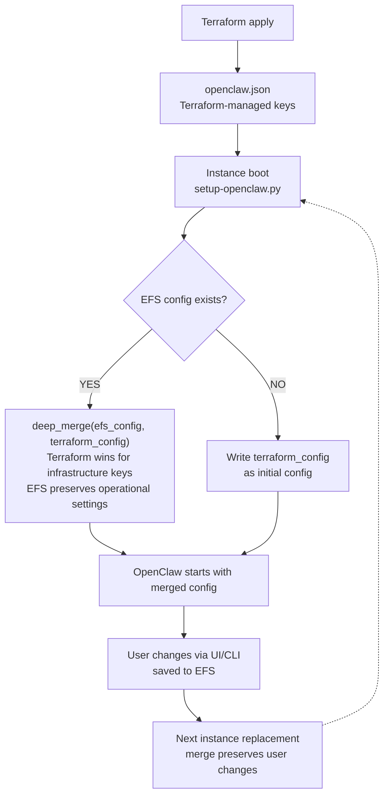

# Architecture

## Overview

## Components

### ALB + Cognito Authentication

The module uses `infrahouse/website-pod/aws` for the ALB, ASG, ACM
certificate, and DNS records. An ALB listener rule at priority 1
injects Cognito OIDC authentication before forwarding to the target
group.

OpenClaw runs in `trusted-proxy` auth mode, reading the user identity
from the `x-amzn-oidc-identity` header set by the ALB. Trusted proxy
CIDRs are automatically derived from the ALB subnet CIDR blocks.

### Single-Instance ASG

OpenClaw is stateful, so the ASG runs exactly one instance
(`asg_min=1, asg_max=1`). ELB health checks replace unhealthy
instances automatically. A lifecycle hook holds new instances in
`Pending:Wait` until the setup script completes and signals
readiness via `ih-aws autoscaling complete`.

### EFS Persistence

An encrypted EFS filesystem is mounted at `/home/openclaw/.openclaw`.
This directory stores:

- `openclaw.json` — gateway configuration
- Agent data and conversation history
- Operational settings configured via the UI

EFS survives instance replacement, AZ failure, and ASG termination.
Backups are enabled by default.

### Config Management Flow

### Secrets Management

API keys for Anthropic and OpenAI are stored in a KMS-encrypted
Secrets Manager secret (via `infrahouse/secret/aws`). The instance
role has `secretsmanager:GetSecretValue` permission on the secret ARN.
At boot, the setup script reads the secret and writes an environment
file for the OpenClaw systemd service.

### CloudWatch Logging

A CloudWatch log group with 365-day retention receives journald logs
from both the `openclaw.service` and `ollama.service` systemd units.
The CloudWatch agent filters and forwards these logs automatically.

### Systemd Hardening

The OpenClaw service runs with:

- `ProtectSystem=strict` — read-only filesystem except allowed paths
- `ProtectHome=tmpfs` — isolated `/home` with `BindPaths` for data
- `NoNewPrivileges=true` — no privilege escalation
- `PrivateTmp=true` — isolated `/tmp`

### IAM Permissions

The instance role receives:

- **Bedrock**: `InvokeModel`, `InvokeModelWithResponseStream` on all
  foundation models and inference profiles, plus
  `ListFoundationModels`, `ListInferenceProfiles`, and Marketplace
  subscribe permissions
- **Lifecycle hook**: `ec2:DescribeInstances` and
  `autoscaling:CompleteLifecycleAction` for signaling readiness
- **Secrets Manager**: `GetSecretValue` on the API keys secret
- **CloudWatch Logs**: `CreateLogStream`, `PutLogEvents`,
  `DescribeLogStreams` on the log group
- **SSM Session Manager**: handled by the website-pod module