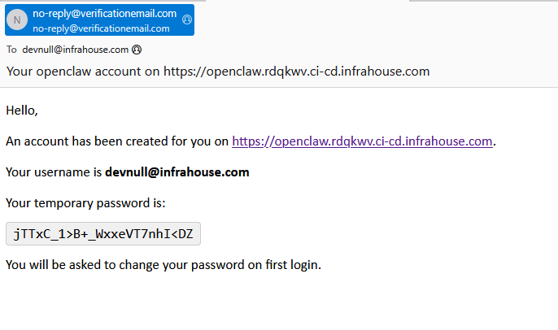

# Getting Started

## Prerequisites

- **Terraform** >= 1.5
- **AWS account** with permissions for EC2, ALB, Cognito, EFS,
  Secrets Manager, CloudWatch, Route53, and Bedrock
- **VPC** with public subnets (for ALB) and private subnets (for EC2)
- **Route53 hosted zone** for DNS and ACM certificate validation
- **InfraHouse Pro AMI** available in your account (owner `303467602807`)

## First Deployment

### 1. Add the module

```hcl
module "openclaw" {
  source  = "registry.infrahouse.com/infrahouse/openclaw/aws"
  version = "0.2.0"
  providers = {
    aws     = aws
    aws.dns = aws
  }

  environment        = "production"
  zone_id            = aws_route53_zone.example.zone_id
  alb_subnet_ids     = module.network.subnet_public_ids
  backend_subnet_ids = module.network.subnet_private_ids
  alarm_emails       = ["ops@example.com"]

  cognito_users = [
    {
      email     = "admin@example.com"
      full_name = "Admin User"
    },
  ]
}
```

### 2. Apply

```bash
terraform init
terraform plan
terraform apply
```

The first apply takes ~10 minutes while cloud-init installs packages,
mounts EFS, installs OpenClaw via npm, and pulls the default Ollama model.

### 3. Add API keys

Populate the Secrets Manager secret with a JSON file containing your
LLM API keys:
```json
{
  "ANTHROPIC_API_KEY": "sk-...", 
  "OPENAI_API_KEY": "sk-..."
}
```

```bash
ih-secrets set $(terraform output -raw secret_name) api-keys.json
terraform apply
```

### 4. Log in

Each user listed in `cognito_users` will receive an email invitation
with a temporary password:



Open the dashboard URL (e.g.
`https://openclaw.infrahouse.com/`) — Cognito will redirect to the
hosted login page. After signing in with the temporary password you
will be prompted to set a permanent one.

## Bedrock First-Time Setup

If you use AWS Bedrock (enabled by default), see the
[FAQ](FAQ.md#getting-bedrock-models-working) for the one-time setup
steps required per AWS account.

## Two-Provider Configuration

If your Route53 zone is in a different AWS account, configure
separate providers:

```hcl
provider "aws" {
  region = "us-west-2"
}

provider "aws" {
  alias  = "dns"
  region = "us-east-1"
  assume_role {
    role_arn = "arn:aws:iam::ACCOUNT_ID:role/route53-admin"
  }
}

module "openclaw" {
  source  = "registry.infrahouse.com/infrahouse/openclaw/aws"
  version = "0.2.0"
  providers = {
    aws     = aws
    aws.dns = aws.dns
  }
  # ...
}
```
